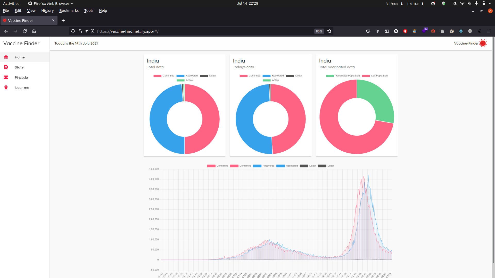
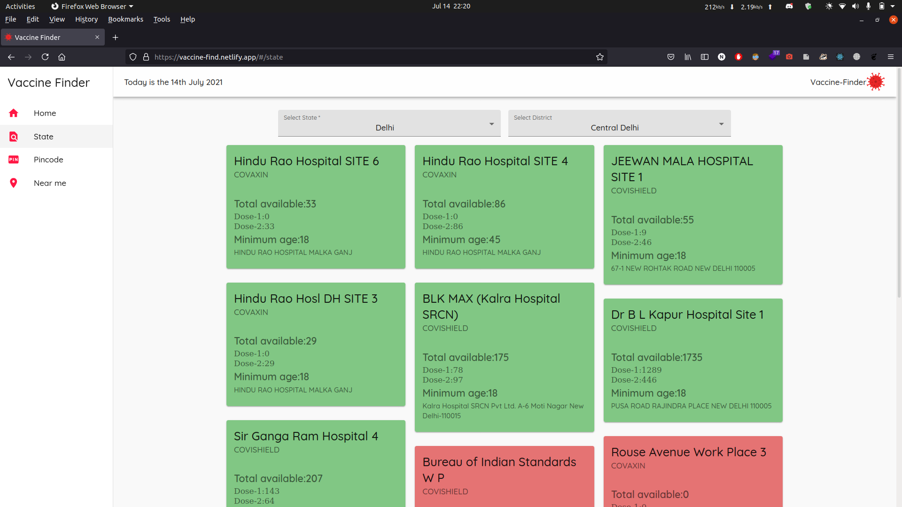
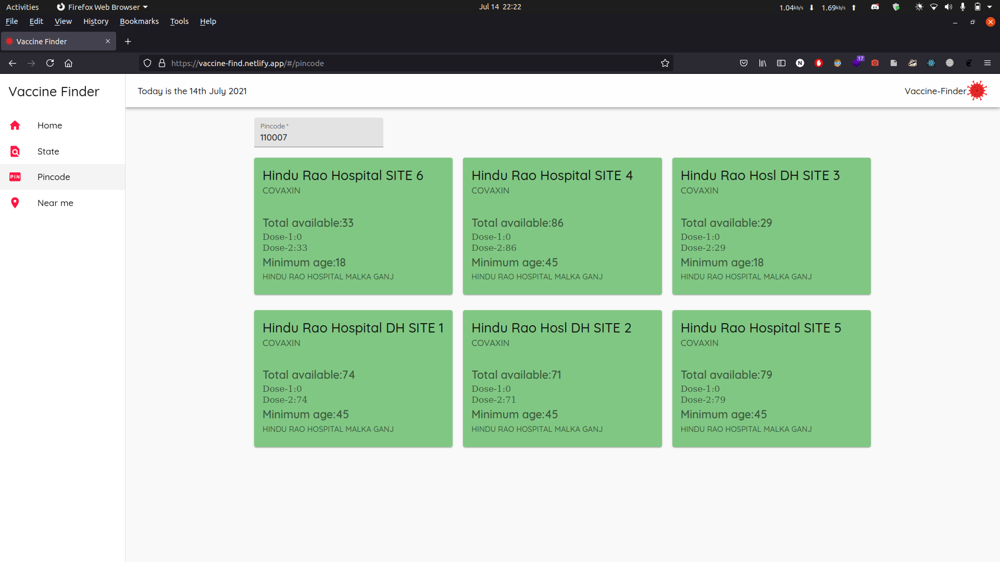
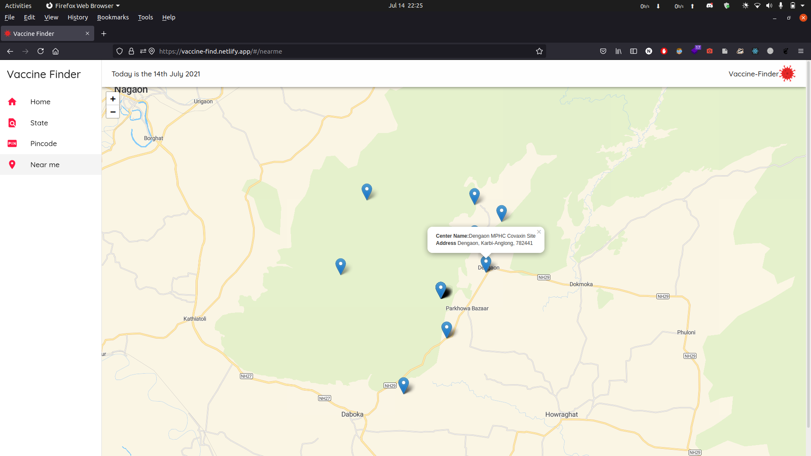

# Vaccine Finder

- Vaccine Finder is a react app that shows COVID vaccination centers near you(Only for INDIA).
- Find vaccination centers by ```State``` ```District``` ```PINCODE``` ```Your Location```
- [Visit the website](https://vaccine-find.netlify.app)

## Images





## References
- [Datameet](https://github.com/datameet/covid19)
- [Api Setu](https://apisetu.gov.in/public/marketplace/api/cowin)
- [Open Disease Data API](https://disease.sh)

## Requirements

- git
- node
- internet connection ;)
 
## Setup
- Clone this project ```git clone https://github.com/nabin-nath/vaccine-finder.git```
- cd to vaccine-finder
- Install dependencies ```npm i```
- Start the server ```npm start```


## Contributing
Pull requests are welcome. For major changes, please open an issue first to discuss what you would like to change.

## License
[MIT](https://choosealicense.com/licenses/mit/)
